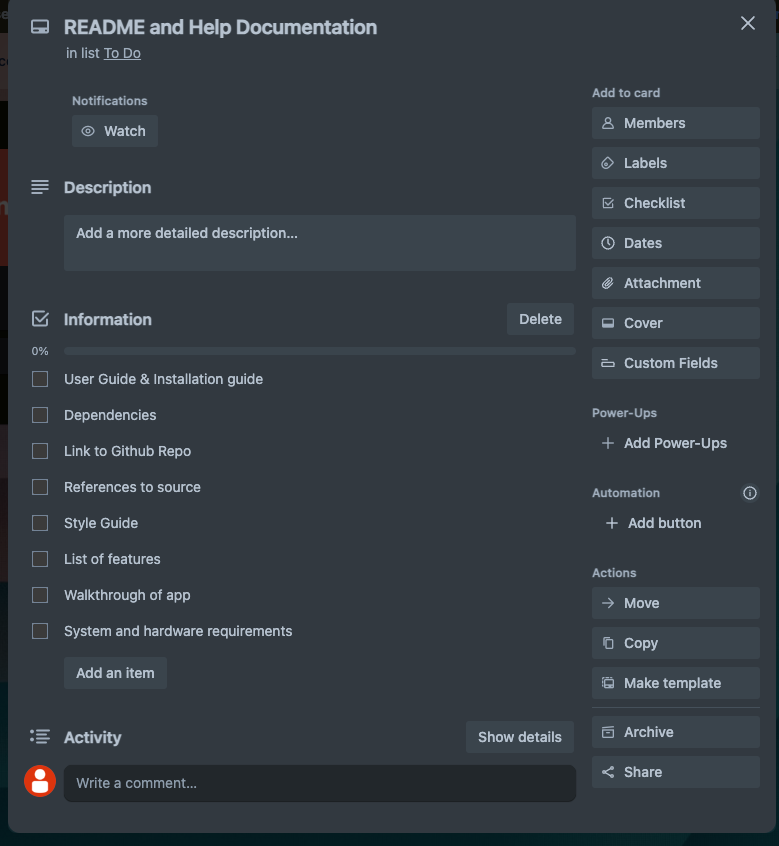
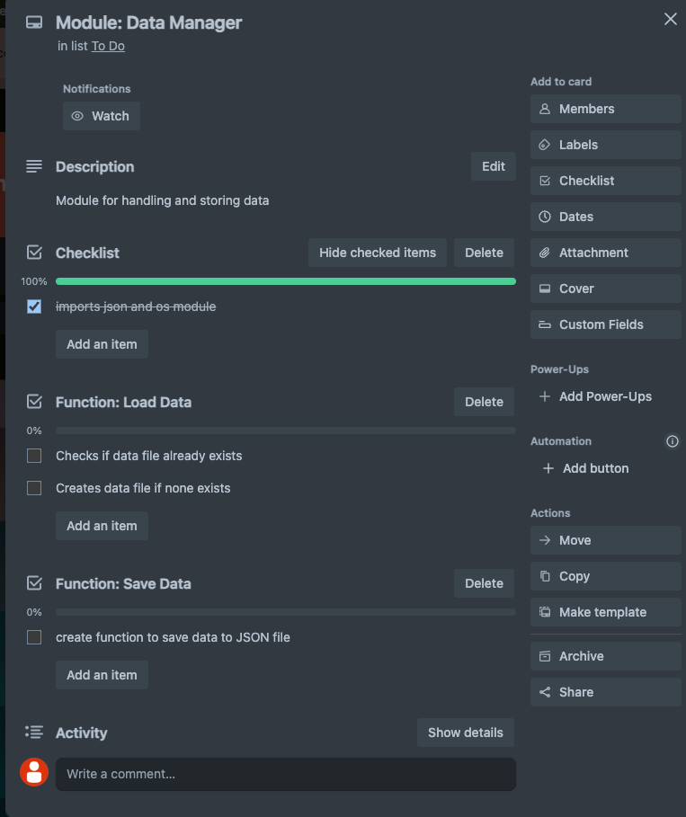

# T1A3 Terminal Application
## Huyen Tram Tiffany Vo
```

 __ __                       ___            _             ___           
|  \  \ ___ ._ _  ___  _ _  / __> ___  _ _ <_>._ _  ___  | . | ___  ___ 
|     |/ . \| ' |/ ._>| | | \__ \<_> || | || || ' |/ . | |   || . \| . \
|_|_|_|\___/|_|_|\___.`_. | <___/<___||__/ |_||_|_|\_. | |_|_||  _/|  _/
                      <___'                        <___'      |_|  |_|  

```
💸₊˚⊹💲 ♡ Welcome to the Money Saving App! This app is designed to help you effectively manage and track your saving goals. Please [click here](#help-documentation) to get started 💸₊˚⊹💲 ♡

# Table of Contents
* [Help Documentation](#help-documentation)
    * [Installation Instructions](#installation-instructions)
    * [How to use the app](#how-to-use-the-app)
    * [Dependencies](#dependencies)

* [Information](#information)
    * [Github Repository](#github-repository)
    * [Introduction](#introduction)
    * [Overview of Features](#overview-of-features)
    * [Implentation Plan](#implementation-plan)
    * [Code Style Guide](#code-style-guide)
    * [References](#references)
    ---

# Help Documentation

## System/Hardware Requirements:
* <b>Operating System:</b> Windows, MacOS, or Linux
* <b>Python Version: </b> Python 3.6 or higher
* <b>Hardware:</b> Any modern computer

## Installation Instructions
1. Clone the Repository:
    * Open the terminal.
    * Run the following command to clone the repository:

    ``` git clone git@github.com:tiffanyv185/T1A3-HuyenTramTiffanyVo.git ```

2. Navigate to cloned directory:
    
    ``` cd T1A3-HuyenTramTiffanyVo ```

3. Run the script in terminal:
   
   ``` ./check_python.sh ```

4. OPTIONAL: To delete existing data and reset app. Run the script in terminal:
    ``` ./retart_app.sh```
----
<b>OR, FOR A STEP BY STEP GUIDE:</b>


1. Download Python:
    * Go to the [Python Downloads Page](https://www.python.org/downloads/).
    * Choose the latest version and download the installer.

2. Install Python:
    * Run the downloaded installer.
    * Check the box "Add Python to PATH" and then click "Install Now".
    * Follow installation instructions.

3. Verify Installation: 
    * Open a terminal
    * Type ```python --version``` and press Enter. You should see the installed Python version.

4. Clone the Repository:
    * Open the terminal.
    * Run the following command to clone the repository:

    ``` git clone git@github.com:tiffanyv185/T1A3-HuyenTramTiffanyVo.git ```

    * Navigate to cloned directory:

    ```cd T1A3-HuyenTramTiffanyVo```

    ```cd src```

5. Set up Virtual Environment
    * create a vitrual environment:

    ``` python3 -m venv venv ```

    * Activate virtual environment:

    ``` source venv/bin/activate ``` 

6. Install Dependencies:
    * Install the required dependencies using `pip`:

    ``` pip install -r requirements.txt ```

7. Run the Application:
    * In your terminal, type:

    ``` python3 main.py```


## How to use the app

1. Select 'Add Goal':

    * From the main menu, type 1 and press Enter.
    * Enter Goal Details:
        * Name: Type the name of your goal and press Enter.
        * Target Amount: Type the target amount you want to save and press Enter.
        * Deadline: Type the deadline for your goal in the format YYYY-MM-DD and press Enter.
        * Confirmation: You will see a message confirming that the goal has been added successfully.

2. Editing a Goal
    * To edit an existing savings goal:
    * From the main menu, type 2 and press Enter.
        * List Goals: A table with your current goals will be displayed.
        * Type the index number of the goal you want to edit and press Enter.
        * Enter New Details:
            * Name: Type the new name for the goal or press Enter to keep the current name.
            * Target Amount: Type the new target amount or press Enter to keep the current amount.
            * Deadline: Type the new deadline in the format YYYY-MM-DD or press Enter to keep the current deadline.
            * Confirmation: You will see a message confirming that the goal has been edited successfully.

3. Deleting a Goal
    * To delete a savings goal:
    * From the main menu, type 3 and press Enter.
        * List Goals: A table with your current goals will be displayed.
        * Select Goal to Delete: Type the index number of the goal you want to delete and press Enter.
        * Confirmation: You will see a message confirming that the goal has been deleted successfully.

4. Listing Goals
    * To list all your savings goals:
    * Select 'List Goals': From the main menu, type 4 and press Enter.
    * View Goals: A table displaying all your goals, including the name, target amount, deadline, saved amount, and progress percentage, will be shown.

5. Contributing to a Goal
    * To contribute to a specific goal:
    * Select 'Contribute to Goal': From the main menu, type 5 and press Enter.
        * List Goals: A table with your current goals will be displayed.
        * Select Goal to Contribute To: Type the index number of the goal you want to contribute to and press Enter.
        * Enter Contribution Amount: Type the amount you want to contribute and press Enter.
        * Confirmation: You will see a message confirming that the contribution has been added successfully.

6. Viewing Contribution History
    * To view the history of your contributions:
    * Select 'View Contribution History': From the main menu, type 6 and press Enter.
        * View History: A table displaying all your contributions, including the goal name, contribution amount, and date, will be shown.

7. Viewing Monthly Report
    * To view the monthly report of your contributions:
    * Select 'View Monthly Report': From the main menu, type 7 and press Enter.
        * Enter Month: Type the month for which you want to view the report in the format YYYY-MM and press Enter.
        * View Report: A table displaying the total contributions for each goal during the specified month will be shown.

8. Exiting the Application
    * To exit the application:
    * Select 'Exit': From the main meny, type 8 and press Enter.
    * Confrimation: You will see a message confirming that you are exiting the application.


## Dependencies
The application requires the following Python packages:
* ```datetime```: For handling dates.
* ``` json```: library modile for JSON encoding and decoding.
* ```prettytable```: library for displaying tabular data in a readable format.
* ```os```: library module for interacting with the operating system
* ```colorama```: library that allows text to displayed in different styles and colours.


# Information

## Github Repository: 
https://github.com/tiffanyv185/T1A3-HuyenTramTiffanyVo

## Introduction
This terminal based application is designed to help users manage their financial goals effectively. Whether they are saving for a holiday, car, house, or any other personal goals, this application will provide a structured way to track their progress, make contributions and stay informed about their milestones and dealines.

## Overview of Features
* <b>Goal Management:</b> Users will be able to easily add, edit, and delete their financial goals. Each goal includes name, target amount, and deadline.

* <b>Contributions:</b> Users will be able to make contributions towards their goals an dtrack how much they have saved over time.
* <b>Progress Tracking:</b> Users can view their progress of each goal and their overall savings at a glance.
* <b>History of Contributions:</b> Users can view a detailed history of their contributions made, allowing them to see how much they've contributed to each goal.
* <b>Monthly Reports:</b> Users can get generated monthly reports to review their savings and contributions for any given month.

## Implementation Plan
1. <b> Identify and understand the requirements:</b>

    The application needs to:
    - Help users manage their saving goals.
    - Allow users to add, edit, and delete saving goals.
    - Enable users to contribute to their saving goals.
    - Track their progress of each goal.
    - Provide a history of contributions.
    - Generate monthly reports of contributions.

2. <b>Designing the Application Structure:</b>

    The application is divided into several modules to seperate concerns and improve maintainability:
    - <b>```data_manager.py```:</b>
        - Purpose: to manage data storage and retrieval. 
        - ```load_data(data)``` function: ensures that existing data is loaded, and if there is no existing data, a new JSON file is created.
        - ```save_data(data)```:  Save user input data to JSON file.

        - <u>Checklist:</u>
            - [x] Imports necessary modules(json and os)
            - [x] File path configuration: Defines a file path where data will be stored ```user_data.json```
            - [x] Loading data: checks if data file ```user_data.json``` already exists using ```os.path.exists(FILE_PATH)```
            - [x] Create new JSON file if none exists.
            - [x] DRY Coding: Functions are short, reuseable and easy to maintain.
            - [x] Default data structure for goals and contributions are stated.
            - [x] Comments are provided extensively.

    - <b> ```goal_manager.py``` function:</b>
        - Purpose: Manage saving goals.
        - ```add_goal(data)``` function: Allows users to add new goals.
        - ```edit_goal(data)``` function: Allows users to edit existing goals.
        - ```delete_goal(data)``` function: Allows users to delete existing goals.
        - ```list_goals(data)``` function: Displays all goals in a readable format for users.

        - <u>Checklist:</u>
            - [x] Imports necessary modules (prettytable and data_manager)
            - [x] Add goal function: Prompts users for new goal details &rarr; creates a goal dictionary &rarr; appends the goal to the data &rarr; saves the data using ```data_manager.save_data(data)``` &rarr; provides user feedback.
            - [x] Edit goal function: Lists existing goals &rarr; prompts users to choose goal with index &rarr; validates the index &rarr; allows the user to update the goal details &rarr; save the updated data &rarr; provides user feedback.
            - [x] Delete goal function: Lists exiting goals &rarr; prompts users to choose goal with index &rarr; validates the index &rarr; removes chosen goal &rarr; saves the updated data &rarr; provides user feedback.
            - [x] List goals function: Creates a table using ```PrettyTable``` with headers &rarr; loops through all the goals &rarr; adds them to the table &rarr; prints the table.
            - [x] Error handling: Customer input index is validated each time. Error messsage is displayed when necessary.
            - [x] DRY code: Functions are focused on a single task. Functions are imported from data_manager to avoiding repeating.
            - [x] Comments are provided extensively.


    - <b>```contribution_manager.py```:</b> Manages contributions and viewing contribution history.
        - Purpose: Allows users to add contributions and view contribution history.
        - ```contribute(data)``` function: Allows users to add contributions to existing goals.
        - ```view_history(data)```: Displays history of all contributions in table for users.

        - <u>Checklist:</u>
            - [x] Imports necessary modules (data_manager, datetime and prettytable)
            - [x] Contribute function: Lists existing goals &rarr; prompts users to choose goal with index &rarr; validates the index &rarr; prompts user for contribution amount &rarr; updates the goal's saved amount &rarr; adds the contribution details to data &rarr; saves the updated data &rarr; then provides feedback to users.
            - [x] View contribution history function: Uses ```prettytable``` to format data &rarr; loops through each contribution in ```user_data.json``` &rarr; add rows to the table &rarr; then displays formatted table to the user.
            - [x] Error handling: Ensures that errors are handled, provides meaningful message to the user when error is found. Index is validated everytime.
            - [x] DRY code: Each function has a single task. data_manager module is imported to avoid repeating.
            - [x] Comments are provided extensively.

    - <b>```report_manager.py```:</b>
        - Purpose: Generate monthly reports for users.
        - ```view_monthly_report(data)``` function: Allows users to view monthly reports of selected month.

        - <u>Checklist:</u>
            - [x] Imports necessary modules (data_manager, datetime and prettytable)
            - [x] Monthly report function: Prompts user for the month in which they want to generate a report for &rarr; creates a table with ```PrettyTable``` &rarr; loops through the contributions and filters by specified month &rarr; aggregates contributions for each goal &rarr; adds the aggregated data to the table and then displays table to the user.
            - [x] DRY code: modules are imported (data_manager) to avoid repeating.
            - [x] Comments are provided extensively.

    - ```main.py```:
        - Purpose: The main entry point of the application for users. Provides the user interface and menu.

        - <u>Checklist:</u>
            - [x] Imports and initialising: Import necessary modules and initialise 'colorama'
            - [x] Main function: Define the 'main' function to handle function's loop.
            - [x] Load data: Use 'data_manager.load_data() to load existing data at the start.
            - [x] User interface: Print the full menu of options to all functions.
            - [x] Menu options: use 'if-elif-else' to handle user choices and call corresponding functions from other modules.
            - [x] Error handling: Provide meaningful error message to user.
            - [x] User feedback: Provide clear feedback for each operation.
            - [x] Saving data: ensure that any changes to data are saved immediately using 'data_manager.save_data(data)' function in the appropriate functions.
            - [x] Exit: Allow users to exit the application.
            - [x] Ensure that script only runs when executed directly by using ``` if __name___ == "_main_": main()```.

3. <b> Project management tools: </b>





## Code Style Guide
This code follows the PEP 8 style guide. the official guide for Python code. PEP 8 provides readable and cosistent conventions for code. 
The following is a summary of PEP 8 Style guide:
* Indentation: Uses 4 spaces per indentation.
* Limit all lines to a maximum of 79 characters.
* Blank Lines: Surround top-level function and class definitions with two lines. Method definitions are surrounded by a single blanke line.
* Imports: Imports are placed together at the top of the the file.
* Whitespace: Use of whitespace to seperate elements in code, such as operators, commas and semicolons.
* Comments: Inline comments used with space after the ```#``` symbol.
* Naming Conventions: Use descriptive names for variables, functions and classes. functions and variables should be lowercase, with words seperated by underscores ```(snake_case)```

More information can be found [here](https://peps.python.org/pep-0008/). 

## References

1.van Rossum G, Warsaw B, Coghlan N. PEP 8 – Style Guide for Python Code. peps.python.org. Published July 5, 2001. https://peps.python.org/pep-0008/

2.Real Python. Documenting Python Code: A Complete Guide. Realpython.com. Published July 25, 2018. https://realpython.com/documenting-python-code/